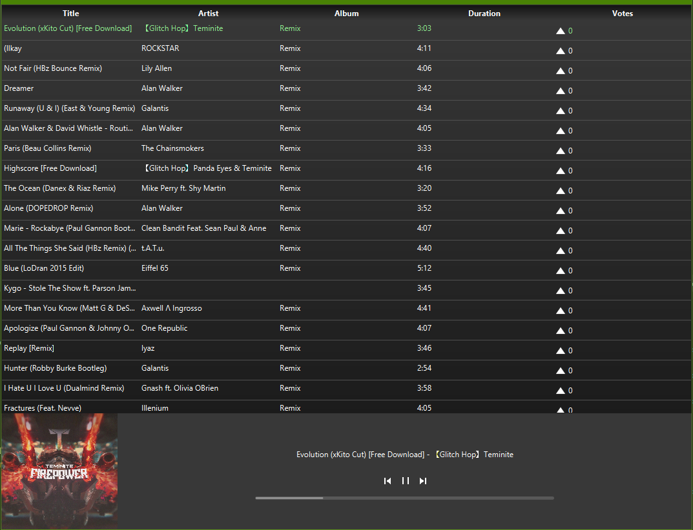

# GSE-Radio

Projekt für Grundlagen-Software-Engineering 2019.
## Anleitung

### Argumente:

Beim starten der gseRadio App können folgende Startparameter übergeben werden:
- `<directoryName>` um den Pfad anzugeben von dem die Musikdateien geladen werden sollen. Per Default wird der Ordner verwendet in dem man sich aktuell befindet.

- `-g` oder `--gui` als Argument um im Gui-Modus zu starten. Als Default wird im Konsolen-Modus gestartet.
Schließt aus das als client oder server gestartet werden soll.

- `-c` oder `--client` um im Client-Modus zu starten, welcher einem Stream zuhören kann.
Schließt aus das als gui oder server gestartet werden soll.

- `-s` oder `--server` um als Server zu starten, welcher seine gespielte Musik über eine Rest Schnittstelle übermittelt.
Schließt aus das als gui oder client gestartet werden soll.
Mögliche Argumente: `--server [--streaming=<port>] [--port=<port>]`

  - `--streaming=<port>` wählt dabei den Port aus auf dem die Musik (über vlc MediaPlayer) gestreamt wird. Wird das Argument nicht angegeben, so spielt die Musik lokal.

  - `--port=<port>` wählt den Port auf den die Rest Schnittstelle reagiert. Wird das Argument nicht angegeben, so wird der Default Port `8080` festgelegt.

### Terminal-Befehle:

Während das Programm läuft können folgende Befehle über das Terminal benutzt werden:

- `'song'` gibt den aktuell gespielten Song aus.

- `'playlist'` gibt die aktuell gespielte Playlist aus, wobei diese in der Reihenfolge ausgegeben wird wie die Lieder gespielt werden.

- `'exit'` um das Programm zu verlassen.

### Gui-Interaktion:

- In der Gui kann für ein Lied gevotet werden, in dem auf den jeweiligen Button neben den Votes geklickt wird (siehe Bild).
Dabei werden die Songs gemäß ihrer Votes sortiert und liegen damit im in der Reihenfolge vor in der sie gespielt werden würden.
Der Song der Aktuell gespielt wird steht dabei ganz oben.

- Verlassen kann man das Programm in dem man das Fenster schließt (das X in der oberen rechten Ecke).

### Client-Interaktion:

- Als Client muss zunächst der Server angegeben werden zu dem man sich verbinden möchte (siehe Bild).
Dazu kann die Server Adresse und der Port aber auch nur die URL verwendet werden.
Möchte man sich zum ausgewählten Server verbinden drückt man auf den Connect Button (Grün).

- Bei erfolgreichem verbinden wird die bereits bekannte Gui geöffnet siehe (Gui-Interaktion).

- Bei einem Fehler wird dieser angezeigt und es kann erneut versucht werden sich zu verbinden.

- Sollte der Client die Verbindung zum Server verlieren, wird er so lange versuchen sich erneut zu verbinden bis der Server wieder erreichbar ist.
